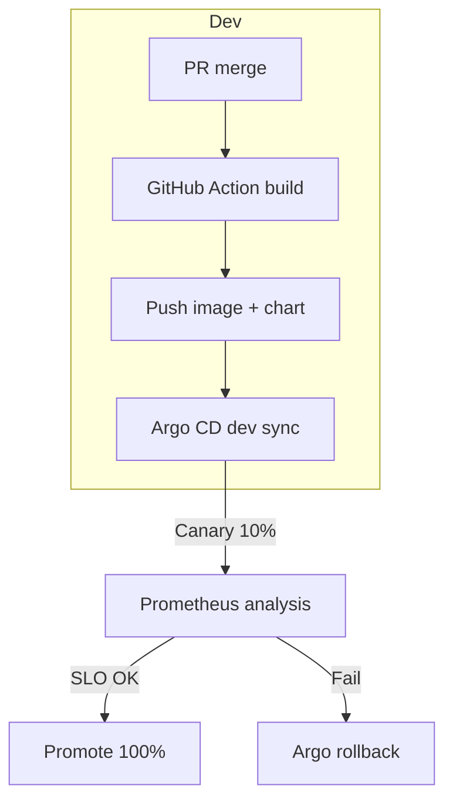

# GeniusERP Suite v0.1 - Continuare Documentație

## 8 · Worker Fleet

Worker‑ii **Python 3.13** sunt împărţiţi pe **capabilităţi** şi accesaţi prin topic-uri RabbitMQ standardizate (`worker.request.<tag>`). Rezultatele sub 30 s ajung în BullMQ (Redis); job-urile lungi (> 30 s) rămân pe RMQ şi pot fi urmărite în Grafana.

| Tag / Worker     | Stack / Libs                          | Topic-uri consumate                                  | Exemple de module care îl invocă | Scalare Default |
| ---------------- | ------------------------------------- | ---------------------------------------------------- | -------------------------------- | --------------- |
| **ocr**          | Python 3.13 + PaddleOCR + Tesseract 5 | `ocr.request`, `ocr.invoice`, `ocr.cad`, `ocr.label` | Archify, iWMS                    | HPA CPU 2-10    |
| **pdf.render**   | Python 3.13 + **Pyppeteer**           | `pdf.render`, `pdf.contract`, `pdf.invoice`          | Mercantiq, Archify               | Celery queue    |
| **tax.vat**      | Python + RapidTax RO                  | `tax.vat`, `tax.eu`, `tax.validate`                  | Mercantiq, Numeriqo Accounting   | Celery queue    |
| **anaf.taxpayer**   | Python 3.13 + requests             | `anaf.taxpayer`, `anaf.taxpayer.validate`             | Vettify (CRM), Mercantiq (Sales, Billing, POS, Procurement), Numeriqo Accounting | Celery queue    |
| **anaf.efactura**   | Python 3.13 + **SignXML**           | `anaf.efactura.submit`, `anaf.efactura.status`        | Mercantiq Sales & Billing                          | Celery queue    |
| **anaf.etransport** | Python 3.13 + requests             | `anaf.etransport.submit`, `anaf.etransport.status`    | iWMS v3 (Logistics)                                | Celery queue    |
| **anaf.saft**       | Python 3.13 + **DUKIntegrator** (JRE) | `anaf.saft.generate`, `anaf.saft.validate`            | Numeriqo Accounting (RO GAAP)                      | Celery queue    |
| **reges**           | Python 3.13 + **zeep** (SOAP)       | `reges.submit`, `reges.sync`                          | Numeriqo People & Payroll                          | Celery queue    |
| **llm**          | llama-cpp-python 8B GPU               | `ai.llm`, `ai.chat`, `ai.extract`, `ai.translate`    | aproape toate                    | GPU node        |
| **gpt4o.proxy**  | aiohttp async                         | `ai.gpt4o`                                           | cerniq, triggerra Studio         | CPU auto        |
| **forecast**     | Prophet + LSTM + XGBoost (Ray 2)      | `ai.forecast`, `ai.demand`, `ai.stock`               | cerniq, iWMS                     | Ray cluster     |
| **etl.sync**     | Python + DuckDB + dbt-core            | `etl.sync`, `etl.lakehouse`, `etl.refresh`           | cerniq, Numeriqo                 | Cron / HPA      |
| **match.ai**     | PyTorch cosine-sim + faiss            | `match.ai`, `match.rfq`, `match.3wm`                 | Procurement                      | CPU             |
| **ai.summary**   | GPT-4o + langchain                    | `ai.summary`, `ai.meeting`, `ai.doc.summary`         | triggerra Hub, Archify           | CPU auto        |
| **ai.classify**  | scikit-learn / zero-shot LLM          | `ai.classify`, `ai.anomaly`, `ai.doc.classify`       | cerniq, Archify                  | CPU             |
| **ai.churn**     | CatBoost, XGBoost                     | `ai.churn`, `ai.customer.risk`                       | vettify                          | CPU             |
| **email.send**   | Python + aiosmtplib                   | `email.send`                                         | toate                            | CPU burst       |
| **notify.slack** | Python 3.13 + **slack_sdk**           | `notify.slack`, `notify.teams`                       | toate                            | CPU burst       |
| **hr.payroll**   | Custom payroll engine RO              | `hr.payroll`, `hr.bonus`, `hr.comp`                  | Numeriqo People                  | sched. monthly  |
| **report.kpi**   | Python + pandas + Jinja2              | `report.kpi`, `report.dashboard`, `report.pdf`       | Shell, cerniq                    | CPU             |
| **image.resize** | Python 3.13 + **pyvips**              | `img.resize`, `img.thumb`                            | Archify                          | CPU             |
| **data.mask**    | Python + Faker                        | `data.mask`, `data.anonymize`                        | Admin Core                       | CPU             |

(Notă: Workerul anaf.taxpayer este utilizat pe scară largă pentru validarea CUI-urilor în Vettify (adăugare clienți/prospects), Mercantiq (facturare, POS, achiziții, furnizori, avize, chitanțe, încasări, bancă) și Numeriqo Accounting (parteneri contabili). Anaf.efactura realizează integrarea e-Factură ANAF în Mercantiq Sales & Billing din F2, iar anaf.saft și reges vor deservi modulele Numeriqo Accounting și People & Payroll în F3. Anaf.etransport este disponibil pentru declarațiile de expediere logistice din iWMS.)

> **Worker Registry API** (`/v1/admin/workers`) expune health, versiunile şi numărul de job-uri active; Tempo adaugă trace-id `wrk-<uuid>` pentru lanţul frontend → API → worker.

---

## 9 · Data & Multitenancy

### 9.1 Model fizic

| Resursă                 | Unit of isolation                     | Observaţii                                                    |
| ----------------------- | ------------------------------------- | ------------------------------------------------------------- |
| **PostgreSQL 17**       | cluster per tenant → schema per modul | DDL versionat; `pgvector` instalat pe toate clusterele.       |
| **MinIO**               | bucket per tenant → prefix per modul  | SSE-C AES-256-GCM; erasure coding 6+2; site replication.      |
| **pgBouncer**           | pool cross-schema                     | DSN runtime: `dbname={{tenant}}_core search_path={{module}}`. |
| **DuckDB / Delta-Lake** | folder Parquet per tenant             | Mounted în cerniq pentru OLAP.                                |
| **Redis 7**             | logical-db per tenant                 | BullMQ, rate-limit, sessions.                                 |

### 9.2 Identificatori

`tid` (Tenant ID), `whid` (Warehouse ID), `mid` (Module ID); chei primare composite.

### 9.3 Onboarding tenant nou (< 60 s)

1. API Admin Core `POST /tenants` → script `bootstrap-tenant.py`.
2. Creează cluster PG, bucket MinIO, Namespace k8s, Keycloak Realm.
3. Helm chart `tenant-bootstrap` deploy; eveniment `tenant.created`.

### 9.4 DR & Back-up

Streaming replication + MinIO site-replication, RPO ≈ 0, RTO < 15 min; backup Glacier 35 zile.

### 9.5 KPI Data-layer

Provision ≤ 60 s · TTFB OLAP 1 M rows ≤ 800 ms · Pool hit pgBouncer ≥ 97 % · Encryption coverage 100 %.

---

## 10 · Security & Compliance

### 10.1 Crypto & Data-in-Transit / at-Rest

- **Encryption at rest**: AES-256-GCM (SSE-C) pe MinIO, `pgcrypto` pe PG; cheie unică per tenant (CMK) stocată în **HashiCorp Vault** HSM-backed.
- **Encryption in flight**: TLS 1.3 obligatoriu; mTLS intern (service → service) emis de cert-manager; Perfect Forward Secrecy (ECDHE); Istio ≥ 1.24.
- **Key rotation**: CMK la 90 zile, certificat mTLS la 24 h; eveniment `security.key.rotated`.

### 10.2 Identitate & Acces

- **Identity Provider**: **Keycloak 23** multi-realm; flux OIDC + PKCE.
- **JWT**: RS256, claims: `tid`, `whid`, `scp`, `role`, `exp`; header `kid` pentru JWKS.
- **RBAC/ABAC**: roluri ierarhice mapate pe Keycloak groups; **OPA Gatekeeper** aplică politici ABAC (scopes × tenant × warehouse).
- **Row / Column Security**: PG RLS rule-based (`tid = current_setting('app.tid') AND (whid = current_setting('app.whid') OR whid IS NULL)`).

### 10.3 Perimetru & API Security

- **Gateway WAF**: Traefik plugin + **OWASP CRS v4**; rate-limit Redis token-bucket (10 req/s user, 1 000 req/min IP).
- **gRPC / GraphQL**: schema allow-list; nested depth limit 8, query cost limit 10 000.
- **Secrets management**: Vault Agent inject side-cars; no secrets in images (`trivy config --severity HIGH`).

### 10.4 Vulnerability & Supply-Chain

- **SCA**: Dependabot + Snyk; fail CI pe CVSS ≥ 7.0.
- **Container scan**: Trivy, Cosign sign + verify; policy-as-code in **Kyverno**.
- **SBOM**: Generated via Syft, uploaded artefact GitHub Release.
- **Pentest cadence**: extern Q2 & Q4; findings → Jira security project.

### 10.5 Audit, Logging & Forensic

- **Centralised logs**: Loki; labels `tid`,`uid`,`mid`,`whid`,`trace_id`; 30 zile hot, 365 zile cold S3.
- **Audit trail**: Archify immutable PDF + hashing merkle-tree; checksum public on IPFS daily.
- **Anomaly detection**: cerniq.ai worker `ai.anomaly` rule-based + LLM classification.
- **Incident response**: playbooks in Triggerra Automation; MTTR target < 30 min.

### 10.6 Compliance Mapping

| Framework | Control zone                      | Status                                  |
| --------- | --------------------------------- | --------------------------------------- |
| GDPR      | Data minimization, RTBF, DPIA     | **Compliant** (DPO review 2025-05)      |
| eIDAS     | Qualified e-Signature, time-stamp | **Compliant** via Archify e-Sign v2     |
| ISO 27001 | A.8, A.9, A.10, A.14              | In scope; internal audit passed 2025-04 |
| SAF-T RO  | XML FZ-ANAF export, PG checksum   | Conform ghid ANAF 2025                  |

### 10.7 KPI Security

- **Gateway auth errors** < 0.1 % trafic
- **Mean time to rotate key** < 5 min
- **Patch window for CVE high** ≤ 48 h
- **False-positive WAF** < 0.01 %
- **Audit log ingestion lag** ≤ 5 s

---

## 11 · Observability

### 11.1 Metrics

- **Prometheus 2.50** colectează la 15 s metrice din Traefik, NestJS (`/metrics`), worker-ii Python, Postgres (`pg\_exporter`) şi sistemele de stocare (MinIO, Redis).
- **Service Level Objectives (SLO)** definite în Grafana 10 cu panel „error-budget-burn-down" pentru gateway, worker-fleet şi fiecare API modul (`latency_p95`, `availability`).
- **Dashboards pre-provisionate** per tenant (UID = `tid`) şi globale (infra, bus, DB).

### 11.2 Logs

- **Loki 3** ca backend; driver Docker —> Loki tag-labels: `tid`, `mid`, `whid`, `trace_id`, `level`.
- Log-schema JSON structurat (NestJS pino + Python structlog).
- Retenţie: 30 zile hot, 365 zile cold (S3 Glacier) via Loki object-store tiered.

### 11.3 Traces

- **OpenTelemetry (OTEL)** auto-instrumentare full-stack (Browser → React → fetch → NestJS → RMQ → worker).
- Collector side-car trimite către **Tempo 2**; trace-id (`wkr-<uuid>`) injectat în RMQ headers.
- **Grafana Tempo Search** permite interogare `service.name="ocr-worker" traceId=<id>`.

### 11.4 Alerting & Synthetic

- **Alertmanager**: reguli pe SLO burn, WAF 4xx spike, queue lag RMQ, pgBouncer pool-hit.
- Rute: Slack `#alerts`, e-mail, PagerDuty.
- **Synthetic checks**: k6 scripts triggeraţi din GitHub-Actions nightly; rezultate push în Prometheus (`blackbox_exporter`).
- **Loki logs-based alerts**: rate WAF block (> 10/min) declanşează `security.block.alert` în Triggerra Automation.

### 11.5 Real-User Monitoring & Frontend Perf

- **Web-Vitals** (LCP, FID, CLS) colectate în React 19; trimise la Prometheus via `prometheus-web-vitals` exporter.
- Panel „Tenant UX" compară LCP P75 vs target 2.5 s.

### 11.6 KPI Observability

| KPI                                   | Target   | Actual 2025-Q2 | Tool              |
| ------------------------------------- | -------- | -------------- | ----------------- |
| **Trace join time** (frontend→worker) | ≤ 1 s    | 720 ms         | Tempo search span |
| **Log ingestion lag**                 | ≤ 5 s    | 3 s            | Loki metrics      |
| **Dashboard refresh latency**         | ≤ 500 ms | 420 ms         | Grafana panel     |
| **Missing labels per log**            | 0        | 0.003 %        | Loki queries      |

> *Toate environment-urile (dev, stage, prod) rulează acelaşi stack observabilitate; în mod stand-alone, fiecare aplicaţie porneşte propria instanţă „mini-grafana" prin **`manage-app.sh start <app> --observability`**.*

---

## 12 · CI/CD Pipeline

### 12.1 Workflow Overview

1. **Trigger** – push PR → branch; or tag `*@*` → release.
2. **Nx Affected** – detect proiectele impactate (`frontend`, `api`, `workers`).
3. **Build & Test** – compile FE (Vite), API (NestJS), workeri (Poetry); Jest/Vitest/Pytest + coverage gates 80 %.
4. **Security Scan** – Trivy (OS+deps), Snyk SCA; fail > HIGH.
5. **SBOM & Sign** – Syft SBOM → upload artefact; Cosign sign image + attest provenance SLSA-level 3.
6. **Publish** – push OCI images → `ghcr.io/organisation/<module>`; upload `remoteEntry.js` → CDN (Cloudflare R2).
7. **Chart Package** – helm package + cosign sign; push OCI chart registry.
8. **Argo CD Sync** – auto-sync dev namespace → canary (10 % traffic).
9. **Canary Analysis** – Prometheus SLO (latency, error-rate). Dacă ok în 30 min → promote 100 %.
10. **Notification** – Slack `#deploy` + GitHub release notes.

### 12.2 GitHub Actions Matrix

| Job      | Matrix                              | Runners            | Durată medie |
| -------- | ----------------------------------- | ------------------ | ------------ |
| `build`  | os: ubuntu-22.04, arch: amd64/arm64 | 4-core, 14 GB      | 6-7 min      |
| `test`   | same                                | 2-core             | 2-3 min      |
| `scan`   | image list                          | 4-core             | 1-2 min      |
| `deploy` | env: dev→stage→prod                 | self-hosted (Argo) | 30–45 s sync |

### 12.3 Supply-Chain Security

- **Cosign**: `cosign sign --key k8s://tenant/<tid>`; verify în Admission Controller Kyverno.
- **Provenance**: `cosign attest --predicate sbom.json --type spdx`.
- **Policy**: pull-request gate → required status `security/sast`, `security/container`.
- **Registry Retention**: keep last 3 minor versions; auto-purge nightly script.

### 12.4 Deployment Strategy (Argo CD app-of-apps)



- Canary uses **metric-based rollout** (`analysis.prometheus.threshold: error_rate<1%, p95_latency<250ms`).
- Rollback publishes event `deploy.rollback` → triggerra Automation posts Slack & JIRA.

### 12.5 KPI CI/CD

| Metric                    | Target   | Actual Q2-2025 |
| ------------------------- | -------- | -------------- |
| Build-and-test pipeline   | ≤ 10 min | 8 min avg      |
| Mean time to deploy (dev) | ≤ 15 min | 12 min         |
| Rollback time             | ≤ 2 min  | 1.3 min        |
| Canary failure rate       | < 2 %    | 1.1 %          |

### 12.6 Example Workflow Snippet

```yaml
name: module-ci
on:
  push:
    paths: ['apps/mercantiq/**']
jobs:
  build-test-scan:
    runs-on: ubuntu-22.04
    steps:
      - uses: actions/checkout@v4
      - uses: pnpm/action-setup@v3
      - run: pnpm install --frozen-lockfile
      - run: pnpm nx affected -t build,test --parallel
      - run: trivy image ghcr.io/org/mercantiq-api:${{ github.sha }}
      - run: cosign sign ghcr.io/org/mercantiq-api:${{ github.sha }}
  publish-deploy:
    needs: build-test-scan
    runs-on: ubuntu-22.04
    steps:
      - name: Push OCI Chart & Image
        run: |
          helm push charts/mercantiq oci://ghcr.io/org/charts
          docker push ghcr.io/org/mercantiq-api:${{ github.sha }}
      - name: Argo CD Sync Dev
        uses: argoproj/argocd-action@v2
        with:
          destination: dev
          app: mercantiq
```

---

## 13 · Scripts & Automation

Colecția de script-uri din `/scripts` este coloana vertebrală pentru **DX**, operare DevOps și guvernanţa multi-tenant. Fiecare script respectă convenția `#!/usr/bin/env bash`, log-uri colorizate și `set -euo pipefail`.

| Script                      | Scope         | Descriere                                                                                                                                              | Principale opțiuni                                        |
| --------------------------- | ------------- | ------------------------------------------------------------------------------------------------------------------------------------------------------ | --------------------------------------------------------- |
| `init.sh`                   | Workspace     | Bootstrap Nx + pnpm + poetry; generează `.env.dev` cu porturi random, setează pre-commit hooks, rulează `nx graph` primul build.                       | `--polyrepo` (skip packages/) · `--with-demo` (seed data) |
| `manage-app.sh`             | Suite / modul | Control servicii: `start/stop/restart/status/logs/switch-env/migrate/backup/restore`; detectează OS (Linux/macOS/WSL). Eliberează porturile cu `lsof`. | `--env dev\|stage\|prod` · `--observability` · `--module <name>` |
| `create-module.ts`          | Dev CLI       | Scaffold micro-frontend + API + workers + Helm; adaugă intrare în `registry.json`, tags Nx, pipeline YAML.                                             | `--with-ai` (adds worker stub) · `--standalone`           |
| `create-worker.py`          | Dev CLI       | Generează schelet worker Python: FastAPI, Celery task, test-suite Pytest, Dockerfile slim.                                                             | `--tag <name>` · `--gpu`                                  |
| `blue-green-deploy.sh`      | SRE           | Execută upgrade Helm cu `helmfile apply`, etichetează `blue`/`green` services și face switch DNS după health.                                          | `--chart <path>` · `--namespace <ns>`                     |
| `migrate-tenant.py`         | DBA           | Migrează tenant între clustere PG (logical replication w/ pg\_dump/restore), updatează config Admin Core și restartă pods.                             | `--tid <uuid>` · `--dst <cluster>`                        |
| `rotate-keys.sh`            | Security      | Rotează CMK în Vault, regenerează SSE-C keys MinIO, updatând politicile; emite event `security.key.rotated`.                                           | `--tenant <tid>`                                          |
| `backup-s3.sh`              | Ops           | Incremental PG base-backup + MinIO snapshot; push în S3 Glacier; etichetează cu date.                                                                  | cron nightly                                              |
| `update-worker-registry.py` | Admin Core    | Health-check flota, scrie status în Redis, trimite alerte la Alertmanager dacă worker absent > 5 min.                                                  | systemd timer 60 s                                        |

### 13.1 Convenţii

- **Idempotent** – rulează de oricâte ori fără efecte secundare; use `flock` pentru lock-file.
- **Verbose flag** `-v` pentru debug; log-uri sub `logs/scripts/yyyymmdd-<name>.log`.
- **Exit codes**: 0 ok, 10 warning (non-blocking), >50 fatal (CI fail).
- **Docs** – fiecare script are header usage + link DocBlock în Wiki.

### 13.2 Automatizări programate

| Task               | Schedule        | Script                      | Output                              |
| ------------------ | --------------- | --------------------------- | ----------------------------------- |
| **Backup nightly** | `02:00 UTC`     | `backup-s3.sh`              | S3 Glacier, event `backup.done`     |
| **Worker health**  | `* * * * *`     | `update-worker-registry.py` | Redis status, Alertmanager          |
| **Key rotation**   | `1st day / 90d` | `rotate-keys.sh`            | Vault new CMK, event                |
| **Cleanup images** | `Sun 03:00`     | `docker-cleanup.sh`         | Removes dangling images, frees disk |

> *To adaugă un script nou, folosește şablonul **`scripts/_template.sh`**, completează header-ul și adaugă step în pipeline **`lint-scripts`** (ShellCheck).*

---

## 14 · Roadmap Snapshot

| Quarter     | Epic / Deliverable                                                                                           | Module(s)               | Status             | KPI / Success Criteria                       |
| ----------- | ------------------------------------------------------------------------------------------------------------ | ----------------------- | ------------------ | -------------------------------------------- |
| **Q3 2025** | **Worker Registry UI (beta)** – dashboard în Admin Core pentru health-check şi scaling manual al worker-ilor | Admin Core, all workers | 🟡 In dev          | Latency API < 200 ms · Adoption > 3 teams    |
|             | **AI Vision Worker (alpha)** – clasificare imagini & detectare defecte pe linia de ambalare                  | iWMS, cerniq            | 🟢 PoC done        | F1 score > 0.9 · Throughput 5 img/s @ GPU T4 |
|             | **Edge IoT Gateway** – suport MQTT pentru cântare & RFID, buffering offline                                  | iWMS                    | 🟡 Design          | Packet loss < 0.5 % · Sync delay < 5 s       |
|             | **GDPR Data Subject Portal (MVP)** – self-service export & erase                                             | Archify                 | 🔴 Not started     | DPIA OK · RTBF < 30 d                        |
|             | Poly-repo CI template & Nx cache remote                                                                      | Dev-DX                  | 🟢 Released        | CI speedup 30 %                              |
| **Q4 2025** | **Worker Registry UI (GA)** – auto-scale suggestions via Prometheus metrics                                  | Admin Core              | 🔵 Planned         | Accuracy scale decisions ≥ 95 %              |
|             | **AI Vision Worker (GA) + cerniq Insight** – heat-map defect rate                                            | iWMS, cerniq            | 🔵 Planned         | Dashboard latency < 1 s                      |
|             | **Multi-cloud DR Pilot** – failover AKS ↔ EKS, 15 min RTO                                                    | Infra                   | 🟡 Terraform phase | Successful failover drill                    |
|             | **ISO 27001 External Audit** – stage 2                                                                       | Security                | 🔵 Planned         | 0 major NC                                   |
|             | **Mobile React Native Suite** – offline PWA parity                                                           | Shell, iWMS, Mercantiq  | 🟡 Beta            | Crash-free sessions > 99 %                   |
|             | **AI Config Advisor** – GPT-4o sugerează tuning SLA                                                          | Admin Core              | 🔴 Design          | Adoption ≥ 20 % tenants                      |

> *Roadmap este revizuit lunar; status emoji: 🔵 planned, 🟡 in progress, 🟢 delivered, 🔴 not started.*

---

## 15 · Resource Requirements

### Minimum CPU/RAM per Environment

| Componentă | CPU/RAM min dev | CPU/RAM min prod | Note |
|------------|----------------|------------------|------|
| **workers.ocr** | 1 vCPU / 1 Gi | 2 vCPU / 2 Gi | HPA 2‑10 replica |
| **workers.llm (GPU)** | 1 A10 / 16 Gi | 2 A10 / 32 Gi | Ray node dedicated |
| **PostgreSQL 17** | 2 vCPU / 4 Gi | 4 vCPU / 8 Gi | pgbouncer connection pooling |
| **MinIO** | 2 vCPU / 3 Gi | 4 vCPU / 6 Gi | erasure coding 6+2 |
| **Istio control plane** | 1 vCPU / 2 Gi | 2 vCPU / 4 Gi | mesh management |
| **RabbitMQ cluster** | 2 vCPU / 4 Gi | 4 vCPU / 8 Gi | message persistence |

### Storage Requirements

| Layer | Dev | Prod | Retention |
|-------|-----|------|-----------|
| **Logs (Loki)** | 50 Gi | 500 Gi | 30 zile hot, 365 zile cold |
| **Metrics (Prometheus)** | 100 Gi | 1 Ti | 15 zile local, backup S3 |
| **Database (PG)** | 200 Gi | 2 Ti | Streaming replication |
| **Object Storage (MinIO)** | 500 Gi | 10 Ti | Site replication enabled |