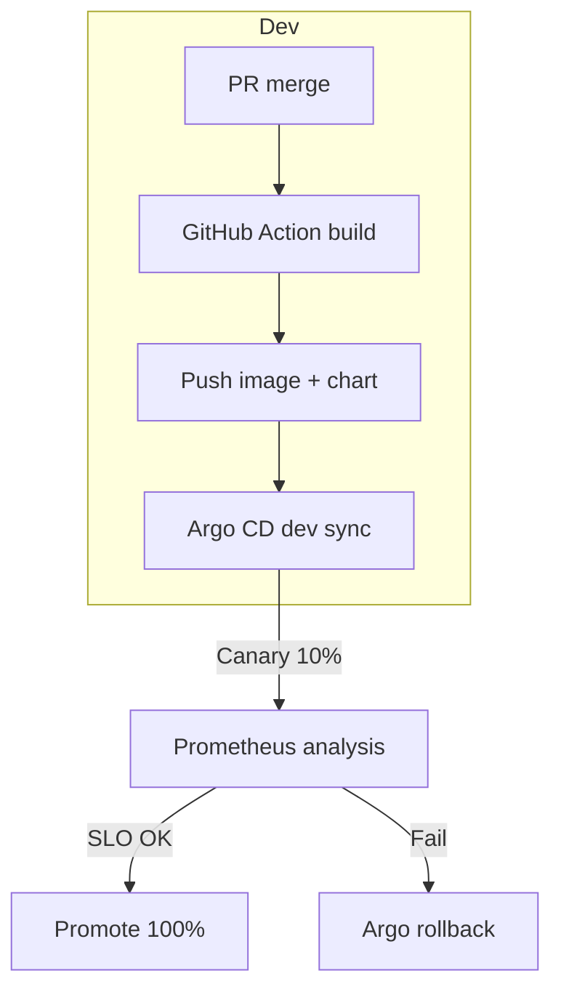

# Roadmap General – GeniusERP Suite

> **Ghid ierarhic și cronologic** pentru implementarea aplicației-mamă **Genius Shell** împreună cu toate cele 13 aplicații stand-alone. Nu conține estimări calendaristice – doar ordinea logică de execuție.

---

## Structura pe faze

| Fază   | Obiectiv principal                   | Conținut                                                                             | Roadmap-uri derivate                                                                                  |
|--------|--------------------------------------|--------------------------------------------------------------------------------------|-------------------------------------------------------------------------------------------------------|
| **F0** | *Foundation & Infrastructure*        | Repo Nx, CI template, Kubernetes & Traefik, Observability Stack, Gateway & Auth    | —                                                                                                     |
| **F1** | *Core Platform*                      | Genius Shell UI, Admin Core (Setări & RBAC), Worker Registry API, Base Workers     | `roadmap/shell.md`, `roadmap/admin-core.md`                                                          |
| **F2** | *Commercial Core Apps*               | Vettify (CRM+Marketing), Mercantiq Sales & Billing, Mercantiq Procurement, iWMS v3 | `roadmap/vettify.md`, `roadmap/mercantiq.md`, `roadmap/iwms.md`                                      |
| **F3** | *Operational & Financial Backbone*   | Numeriqo Manufacturing, Accounting (RO GAAP), People & Payroll                     | `roadmap/numeriqo-manufacturing.md`, `roadmap/numeriqo-accounting.md`, `roadmap/numeriqo-people.md`  |
| **F4** | *Collaboration & Automation*         | Triggerra Collaboration Hub, Triggerra Automation Studio                           | `roadmap/triggerra-collab.md`, `roadmap/triggerra-automation.md`                                     |
| **F5** | *Knowledge & Analytics*              | Archify (DMS + e-Sign), Cerniq (Cognitive BI)                                      | `roadmap/archify.md`, `roadmap/cerniq.md`                                                            |
| **F6** | *Hardening & Multi-Cloud*            | Multi-cloud DR, ISO 27001 audit, Mobile React Native Suite                         | `roadmap/dr.md`, `roadmap/mobile-suite.md`, `roadmap/iso27001.md`                                    |
| **F7** | *Continuous Improvement*             | AI Config Advisor, AI Vision GA, Edge IoT Gateway, GDPR Portal                     | roadmap-uri viitoare                                                                                 |

> Începerea unei faze este permisă **doar după îndeplinirea livrabilelor fazei anterioare**.

---

## F0 · Foundation & Infrastructure

1. **Repo Bootstrap**
   - Rulează `init.sh`
   - Generează workspace Nx
   - Configurează pnpm, poetry, pre-commit

2. **Cloud Infra** 
   - Terraform: VPC, k8s (dev, stage, prod)
   - Storage Class

3. **Gateway & Auth**
   - Traefik v3
   - Keycloak 23
   - TLS/mTLS, rate-limit

4. **Observability Stack**
   - Prometheus, Loki, Tempo
   - Grafana dashboards provisionate

5. **CI Template**
   - GitHub Actions
   - Nx affected, Trivy
   - Cosign signing, publish OCI

> **Gate F0 → F1**: CI verde, Gateway servește `/health`, Grafana panourile up.

---

## F1 · Core Platform

1. **Genius Shell UI scaffold**
   - Remote-loader
   - Layout, theme tokens

2. **Admin Core v0.9**
   - Setări
   - RBAC Directory
   - Theme Hub

3. **Worker Registry API**
   - Health endpoints
   - Redis status

4. **Event-Bus Conventions**
   - RMQ namespaces
   - Contract-tests

5. **Base Workers**
   - `ocr`
   - `pdf.render`
   - `email.send`

> **Gate F1 → F2**: Shell afișează 3 widget-uri demo, Worker Registry verde.

---

## F2 · Commercial Core Apps

1. **Vettify CRM & Marketing**
   - Micro-frontend, API
   - Workeri AI (`ai.summary`, `ai.churn`)

2. **Mercantiq Sales & Billing**
   - POS, Invoice
   - e-Factură
   - Events `sales.*`

3. **Mercantiq Procurement**
   - RFQ → PO → GRN
   - Events `procurement.*`

4. **iWMS v3**
   - Multi-warehouse
   - Mobile RF
   - Workers `forecast`, `match.ai`

> **Gate F2 → F3**: Flux „Order-to-Cash" și „Procure-to-Pay" demonstrat end-to-end.

---

## F3 · Operational & Financial Backbone

1. **Numeriqo Manufacturing**
   - BOM, MRP II
   - Shop-floor terminals

2. **Numeriqo Accounting (RO GAAP)**
   - Partidă dublă
   - SAF-T, balanțe

3. **Numeriqo People & Payroll**
   - Salarii RO
   - Revisal, time-off

> **Gate F3 → F4**: contabilitate generează balanță din tranzacții Mercantiq; payroll postează jurnal în Accounting.

---

## F4 · Collaboration & Automation

1. **Triggerra Collaboration Hub**
   - Kanban, chat
   - OKR alignment

2. **Triggerra Automation Studio**
   - Flow builder low-code
   - Runtime sandbox

> **Gate F4 → F5**: cel puțin 100 workflow-uri active și 10 board-uri Kanban live.

---

## F5 · Knowledge & Analytics

1. **Archify**
   - DMS, OCR
   - e-Sign
   - Retention policies

2. **Cerniq**
   - Cognitive BI
   - AI2BI, AI4BI
   - Lakehouse Delta-Parquet

> **Gate F5 → F6**: Dashboard Cerniq consumă date din toate modulele, e-Sign calificat funcțional.

---

## F6 · Hardening & Multi‑Cloud

1. **Disaster Recovery Multi-Cloud**
   - AKS ↔ EKS
   - Failover drill

2. **ISO 27001 External Audit**
   - Stage 2
   - 0 non-conformități majore

3. **Mobile React Native Suite**
   - Offline parity cu Shell & iWMS

> **Gate F6 → F7**: Failover ≤ 15 min, audit trecut, mobile‑suite disponibil în store intern.

---

## F7 · Continuous Improvement (rolling)

- **AI Vision GA**
  - Clasificare imagini în producție
  - Defect heat-map

- **Edge IoT Gateway GA**
  - MQTT buffering
  - Sync offline

- **AI Config Advisor**
  - GPT-4o recomandă tuning SLO

- **GDPR Data Subject Portal**
  - Export/erase self-service

- **Marketplace Automation Templates**
  - Fluxuri pregătite community

---

## Milestone-uri principale

| Cod    | Definiție               | Criteriu de trecere                                           |
|--------|-------------------------|---------------------------------------------------------------|
| **M0** | ✔ Infra Ready          | Gateway & Observability online, CI verde                     |
| **M1** | ✔ Shell GA             | Shell + Admin + Workers de bază live                         |
| **M2** | ✔ Commercial Core      | Vânzări + CRM + WMS funcționează cross-module                |
| **M3** | ✔ Financial Backbone   | Accounting & Payroll primesc evenimente și publică rapoarte  |
| **M4** | ✔ Collab & Automation  | 100+ workflow-uri în producție, board-uri Kanban active      |
| **M5** | ✔ BI Launch            | Cerniq dashboards real-time, forecast AI live                |
| **M6** | ✔ DR Certified         | Failover multi-cloud reușit fără downtime perceptibil        |

---

## KPI Umbrelă Proiect (fără dată)

- **Deployment frequency** ≥ 2 release‑uri / săptămână / modul
- **Mean Time to Restore (MTTR)** ≤ 30 min
- **Error Budget Burn global** < 5 % / lună
- **Adopție Shell** – ≥ 90 % utilizatori activi în suite

---

## 11 · Infrastructura de Conformitate Fiscală & HR Națională

Pentru a asigura respectarea cerințelor legale fiscale și de HR, GeniusERP include o **flotă de workeri comuni** integrați cu platformele naționale ANAF și Inspecția Muncii. Acești workeri sunt microservicii Python reutilizabile de toate modulele relevante, oferind un punct unic de conectare la sistemele guvernamentale (evitând duplicarea logicii în fiecare aplicație). Fiecare worker expune contracte JSON bine definite (schema de intrare/ieșire) și operează prin topic-uri RabbitMQ canonice (`anaf.*`, `reges`), similar celorlalți workeri din suită.

- **anaf.taxpayer** – interogare și validare *CUI* (cod fiscal) prin serviciul web ANAF. La cerere, returnează date oficiale despre contribuabil (denumire, stare TVA etc.), inclusiv verificarea validității și a înregistrării în registrul RO e-Factura. *(Ex: utilizat în Vettify la adăugarea clienților/prospects, în Mercantiq la facturare/POS/achiziții/furnizori/avize/chitanțe/încasări/bancă, și în Numeriqo Accounting pentru parteneri contabili.)*

- **anaf.efactura** – preluare, semnare și transmitere *e-Factură* (factură electronică XML conform standardului național) către sistemul ANAF. Worker-ul primește datele facturii (sau XML-ul generat de modulul de vânzări), aplică semnătura electronică unde e cazul și folosește autentificare pe portalul ANAF (OAuth2/token sau certificat digital) pentru a depune factura. Rezultatele (ex: identificatorul GUID al facturii sau erori de validare) sunt trimise înapoi modulului solicitant.

- **anaf.etransport** – generare și transmitere declarații *e-Transport* pentru bunurile cu risc fiscal ridicat. Acest worker compilează datele de transport (expeditor, destinatar, categorii de bunuri, cantități) conform schema ANAF, și le transmite către RO e-Transport folosind certificatul digital al companiei. În urma depunerii, primește codul UIT unic (și documentul PDF cu QR) pe care îl pune la dispoziția modulului logistic (ex: iWMS) pentru conformitate în timpul transportului.

- **anaf.saft** – colectare date contabile și generare fișier *SAF-T D406* conform specificațiilor ANAF. Worker-ul extrage din baza de date contabilă tranzacțiile, conturile și registrele cerute, construiește fișierul XML SAF-T și îl **validează oficial** prin kit-ul ANAF **DUKIntegrator** (inclus în container). Fișierul rezultat (XML + PDF aferent) este returnat gata de depunere, asigurându-se că respectă schema și regulile de validare ANAF. Autentificarea și semnarea electronică pentru depunerea efectivă (dacă se face automat) se realizează tot prin certificate digitale, gestionate securizat.

- **reges** – transmitere automată a registrului de evidență a salariaților (*REGES Online*). Worker-ul primește evenimente din modulul HR (angajare nouă, modificare contract, încetare) și apelează API-ul Inspecției Muncii pentru a trimite datele actualizate în registrul online oficial (în formatul impus, ex. XML conform XSD Revisal). Integrarea folosește protocolul oficial (ex: SOAP Web Service via **zeep**) și certificatul digital calificat al angajatorului pentru autentificare. Rezultatele (confirmarea înregistrării sau erori) sunt captate și pot declanșa notificări în platformă.

Fiecare dintre workeri operează asincron (prin cozi RMQ dedicate) și propagă evenimente de răspuns (exemple: `tax.vat.validated`, `sales.invoice.efactura_sent`, `wms.shipment.etransport_code` sau `accounting.saft.ready`) consumate de modulele de business. Toate credențialele sensibile (token-uri OAuth, certificate PKI, chei API) nu sunt hardcodate, ci sunt gestionate prin **External Secrets** (ex. stocate în HashiCorp Vault și montate la runtime în workeri). De asemenea, workeri precum cei ANAF utilizează validatori oficiali (ex. librăria DUK/Validator ANAF pentru SAF-T și e-Factura) pentru consistență maximă cu cerințele autorităților. 

Acești workeri comuni apar în **Worker Registry** (Admin Core) alături de ceilalți workeri, expunând endpoint-urile de health/status și metricile de performanță. Astfel, platforma GeniusERP este pregătită încă din fazele de bază să gestioneze obligațiile de raportare către autorități (ANAF, Inspecția Muncii) într-un mod unitar și automatizat, oricare ar fi modulul de business care generează acele date.

---

## Următorii pași

1. **Validare roadmap** cu stakeholder-ii principali
2. **Creare backlog** F0 + F1 în Jira, etichetat `scope:foundation`
3. **Generare roadmap-uri** individuale în directorul `roadmap/`
4. **Kick-off F0** → trecere la execuție

> Pentru reguli stricte de proiectare consultați `0_Instructiuni_stricte_de_proiectare.md`.

---

# GeniusERP Suite v0.1 - Documentație Extinsă

## 8 · Worker Fleet

Worker‑ii **Python 3.13** sunt împărţiţi pe **capabilităţi** şi accesaţi prin topic-uri RabbitMQ standardizate (`worker.request.<tag>`). Rezultatele sub 30 s ajung în BullMQ (Redis); job-urile lungi (> 30 s) rămân pe RMQ şi pot fi urmărite în Grafana.

| Tag / Worker     | Stack / Libs                          | Topic-uri consumate                                  | Exemple de module care îl invocă | Scalare Default |
| ---------------- | ------------------------------------- | ---------------------------------------------------- | -------------------------------- | --------------- |
| **ocr**          | Python 3.13 + PaddleOCR + Tesseract 5 | `ocr.request`, `ocr.invoice`, `ocr.cad`, `ocr.label` | Archify, iWMS                    | HPA CPU 2-10    |
| **pdf.render**   | Python 3.13 + **Pyppeteer**           | `pdf.render`, `pdf.contract`, `pdf.invoice`          | Mercantiq, Archify               | Celery queue    |
| **tax.vat**      | Python + RapidTax RO                  | `tax.vat`, `tax.eu`, `tax.validate`                  | Mercantiq, Numeriqo Accounting   | Celery queue    |
| **anaf.taxpayer**   | Python 3.13 + requests             | `anaf.taxpayer`, `anaf.taxpayer.validate`             | Vettify (CRM), Mercantiq (Sales, Billing, POS, Procurement), Numeriqo Accounting | Celery queue    |
| **anaf.efactura**   | Python 3.13 + **SignXML**           | `anaf.efactura.submit`, `anaf.efactura.status`        | Mercantiq Sales & Billing                          | Celery queue    |
| **anaf.etransport** | Python 3.13 + requests             | `anaf.etransport.submit`, `anaf.etransport.status`    | iWMS v3 (Logistics)                                | Celery queue    |
| **anaf.saft**       | Python 3.13 + **DUKIntegrator** (JRE) | `anaf.saft.generate`, `anaf.saft.validate`            | Numeriqo Accounting (RO GAAP)                      | Celery queue    |
| **reges**           | Python 3.13 + **zeep** (SOAP)       | `reges.submit`, `reges.sync`                          | Numeriqo People & Payroll                          | Celery queue    |
| **llm**          | llama-cpp-python 8B GPU               | `ai.llm`, `ai.chat`, `ai.extract`, `ai.translate`    | aproape toate                    | GPU node        |
| **gpt4o.proxy**  | aiohttp async                         | `ai.gpt4o`                                           | cerniq, triggerra Studio         | CPU auto        |
| **forecast**     | Prophet + LSTM + XGBoost (Ray 2)      | `ai.forecast`, `ai.demand`, `ai.stock`               | cerniq, iWMS                     | Ray cluster     |
| **etl.sync**     | Python + DuckDB + dbt-core            | `etl.sync`, `etl.lakehouse`, `etl.refresh`           | cerniq, Numeriqo                 | Cron / HPA      |
| **match.ai**     | PyTorch cosine-sim + faiss            | `match.ai`, `match.rfq`, `match.3wm`                 | Procurement                      | CPU             |
| **ai.summary**   | GPT-4o + langchain                    | `ai.summary`, `ai.meeting`, `ai.doc.summary`         | triggerra Hub, Archify           | CPU auto        |
| **ai.classify**  | scikit-learn / zero-shot LLM          | `ai.classify`, `ai.anomaly`, `ai.doc.classify`       | cerniq, Archify                  | CPU             |
| **ai.churn**     | CatBoost, XGBoost                     | `ai.churn`, `ai.customer.risk`                       | vettify                          | CPU             |
| **email.send**   | Python + aiosmtplib                   | `email.send`                                         | toate                            | CPU burst       |
| **notify.slack** | Python 3.13 + **slack_sdk**           | `notify.slack`, `notify.teams`                       | toate                            | CPU burst       |
| **hr.payroll**   | Custom payroll engine RO              | `hr.payroll`, `hr.bonus`, `hr.comp`                  | Numeriqo People                  | sched. monthly  |
| **report.kpi**   | Python + pandas + Jinja2              | `report.kpi`, `report.dashboard`, `report.pdf`       | Shell, cerniq                    | CPU             |
| **image.resize** | Python 3.13 + **pyvips**              | `img.resize`, `img.thumb`                            | Archify                          | CPU             |
| **data.mask**    | Python + Faker                        | `data.mask`, `data.anonymize`                        | Admin Core                       | CPU             |
| **gdpr.consent.ai** | Python 3.13 + PostgreSQL 17        | `gdpr.consent.track`, `gdpr.consent.withdraw`, `gdpr.consent.audit` | Vettify AI, toate modulele AI | CPU             |
| **gdpr.rtbf**     | Python 3.13 + Celery                 | `gdpr.rtbf.request`, `gdpr.rtbf.delete`, `gdpr.rtbf.verify` | toate modulele cu AI data       | CPU             |
| **gdpr.classify** | Python 3.13 + ML/regex               | `gdpr.classify.pii`, `gdpr.classify.data`, `gdpr.classify.impact` | toate modulele AI            | CPU             |
| **gdpr.audit.ai** | Python 3.13 + crypto                 | `gdpr.audit.decision`, `gdpr.audit.bias`, `gdpr.audit.transparency` | toate AI workers          | CPU             |
| **facebook.pixel.ai** | Python 3.13 + OpenAI GPT-4 + pgvector | `social.facebook.pixel`, `audience.insights`, `conversion.attribution` | Vettify CRM, Marketing AI | CPU + GPU       |
| **linkedin.sales.ai** | Python 3.13 + Anthropic Claude + Redis | `social.linkedin.prospect`, `intent.detection`, `network.analysis` | Vettify CRM, B2B Lead Generation | CPU + GPU       |
| **twitter.sentiment.ai** | Python 3.13 + VADER + Transformers | `social.twitter.sentiment`, `brand.monitoring`, `crisis.detection` | Vettify CRM, Brand Intelligence | CPU + GPU       |
| **tiktok.analytics.ai** | Python 3.13 + Computer Vision + TensorFlow | `social.tiktok.content`, `viral.scoring`, `trend.forecasting` | Vettify CRM, Content Marketing | CPU + GPU       |
| **vision.call.analysis** | Python 3.13 + OpenCV + MediaPipe | `call.emotion.detection`, `engagement.scoring`, `attention.mapping` | Vettify CRM, Customer Intelligence | CPU + GPU       |
| **voice.sentiment.ai** | Python 3.13 + Whisper + AssemblyAI | `voice.transcription`, `call.sentiment`, `speaker.identification` | Vettify CRM, Conversation Intelligence | CPU + GPU       |
| **behavior.pattern.ai** | Python 3.13 + TensorFlow + PyTorch | `behavior.analysis`, `churn.prediction`, `journey.optimization` | Vettify CRM, Predictive Analytics | CPU + GPU       |
| **content.personalization.ai** | Python 3.13 + GPT-4 + Recommendations | `content.personalization`, `ab.testing`, `engagement.optimization` | Vettify CRM, Marketing Automation | CPU + GPU       |
| **ab.testing.ml** | Python 3.13 + scipy.stats + MLlib | `ab.testing.automated`, `significance.detection`, `optimization.continuous` | Vettify Marketing, Campaign Optimization | CPU + GPU       |
| **dynamic.pricing.ai** | Python 3.13 + XGBoost + Time Series | `pricing.optimization`, `demand.forecasting`, `competitor.analysis` | Vettify Marketing, Revenue Optimization | CPU + GPU       |
| **attribution.modeling.ai** | Python 3.13 + Markov Chains + Survival Analysis | `attribution.modeling`, `roas.optimization`, `channel.analysis` | Vettify Marketing, Attribution Intelligence | CPU + GPU       |
| **campaign.optimization.ai** | Python 3.13 + Reinforcement Learning | `campaign.optimization`, `budget.allocation`, `audience.adjustment` | Vettify Marketing, Automated Campaigns | CPU + GPU       |

(Notă: Workerul anaf.taxpayer este utilizat pe scară largă pentru validarea CUI-urilor în Vettify (adăugare clienți/prospects), Mercantiq (facturare, POS, achiziții, furnizori, avize, chitanțe, încasări, bancă) și Numeriqo Accounting (parteneri contabili). Anaf.efactura realizează integrarea e-Factură ANAF în Mercantiq Sales & Billing din F2, iar anaf.saft și reges vor deservi modulele Numeriqo Accounting și People & Payroll în F3. Anaf.etransport este disponibil pentru declarațiile de expediere logistice din iWMS. **Workers GDPR** asigură compliance completă pentru toate funcționalitățile AI, oferind management consimțământ, Right to be Forgotten, clasificare automată a datelor și audit trails pentru transparența algoritmică. **Workers AI Avansați** reprezintă noua generație de capabilities pentru CRM care depășesc HubSpot/Salesforce: Social Media AI (Facebook Pixel, LinkedIn Sales, Twitter Sentiment, TikTok Analytics), Customer Intelligence AI (Vision Call Analysis, Voice Sentiment, Behavior Pattern, Content Personalization) și Marketing AI Modern (A/B Testing ML, Dynamic Pricing, Attribution Modeling, Campaign Optimization) - toate cu suport GPU pentru performanțe enterprise.)

> **Worker Registry API** (`/v1/admin/workers`) expune health, versiunile şi numărul de job-uri active; Tempo adaugă trace-id `wrk-<uuid>` pentru lanţul frontend → API → worker.

---

## 9 · Data & Multitenancy

### 9.1 Model fizic

| Resursă                 | Unit of isolation                     | Observaţii                                                    |
| ----------------------- | ------------------------------------- | ------------------------------------------------------------- |
| **PostgreSQL 17**       | cluster per tenant → schema per modul | DDL versionat; `pgvector` instalat pe toate clusterele.       |
| **MinIO**               | bucket per tenant → prefix per modul  | SSE-C AES-256-GCM; erasure coding 6+2; site replication.      |
| **pgBouncer**           | pool cross-schema                     | DSN runtime: `dbname={{tenant}}_core search_path={{module}}`. |
| **DuckDB / Delta-Lake** | folder Parquet per tenant             | Mounted în cerniq pentru OLAP.                                |
| **Redis 7**             | logical-db per tenant                 | BullMQ, rate-limit, sessions.                                 |

### 9.2 Identificatori

`tid` (Tenant ID), `whid` (Warehouse ID), `mid` (Module ID); chei primare composite.

### 9.3 Onboarding tenant nou (< 60 s)

1. API Admin Core `POST /tenants` → script `bootstrap-tenant.py`.
2. Creează cluster PG, bucket MinIO, Namespace k8s, Keycloak Realm.
3. Helm chart `tenant-bootstrap` deploy; eveniment `tenant.created`.

### 9.4 DR & Back-up

Streaming replication + MinIO site-replication, RPO ≈ 0, RTO < 15 min; backup Glacier 35 zile.

### 9.5 KPI Data-layer

Provision ≤ 60 s · TTFB OLAP 1 M rows ≤ 800 ms · Pool hit pgBouncer ≥ 97 % · Encryption coverage 100 %.

---

## 10 · Security & Compliance

### 10.1 Crypto & Data-in-Transit / at-Rest

- **Encryption at rest**: AES-256-GCM (SSE-C) pe MinIO, `pgcrypto` pe PG; cheie unică per tenant (CMK) stocată în **HashiCorp Vault** HSM-backed.
- **Encryption in flight**: TLS 1.3 obligatoriu; mTLS intern (service → service) emis de cert-manager; Perfect Forward Secrecy (ECDHE); Istio ≥ 1.24.
- **Key rotation**: CMK la 90 zile, certificat mTLS la 24 h; eveniment `security.key.rotated`.

### 10.2 Identitate & Acces

- **Identity Provider**: **Keycloak 23** multi-realm; flux OIDC + PKCE.
- **JWT**: RS256, claims: `tid`, `whid`, `scp`, `role`, `exp`; header `kid` pentru JWKS.
- **RBAC/ABAC**: roluri ierarhice mapate pe Keycloak groups; **OPA Gatekeeper** aplică politici ABAC (scopes × tenant × warehouse).
- **Row / Column Security**: PG RLS rule-based (`tid = current_setting('app.tid') AND (whid = current_setting('app.whid') OR whid IS NULL)`).

### 10.3 Perimetru & API Security

- **Gateway WAF**: Traefik plugin + **OWASP CRS v4**; rate-limit Redis token-bucket (10 req/s user, 1 000 req/min IP).
- **gRPC / GraphQL**: schema allow-list; nested depth limit 8, query cost limit 10 000.
- **Secrets management**: Vault Agent inject side-cars; no secrets in images (`trivy config --severity HIGH`).

### 10.4 Vulnerability & Supply-Chain

- **SCA**: Dependabot + Snyk; fail CI pe CVSS ≥ 7.0.
- **Container scan**: Trivy, Cosign sign + verify; policy-as-code in **Kyverno**.
- **SBOM**: Generated via Syft, uploaded artefact GitHub Release.
- **Pentest cadence**: extern Q2 & Q4; findings → Jira security project.

### 10.5 Audit, Logging & Forensic

- **Centralised logs**: Loki; labels `tid`,`uid`,`mid`,`whid`,`trace_id`; 30 zile hot, 365 zile cold S3.
- **Audit trail**: Archify immutable PDF + hashing merkle-tree; checksum public on IPFS daily.
- **Anomaly detection**: cerniq.ai worker `ai.anomaly` rule-based + LLM classification.
- **Incident response**: playbooks in Triggerra Automation; MTTR target < 30 min.

### 10.6 Compliance Mapping

| Framework | Control zone                      | Status                                  |
| --------- | --------------------------------- | --------------------------------------- |
| GDPR      | Data minimization, RTBF, DPIA     | **Compliant** (DPO review 2025-05)      |
| eIDAS     | Qualified e-Signature, time-stamp | **Compliant** via Archify e-Sign v2     |
| ISO 27001 | A.8, A.9, A.10, A.14              | In scope; internal audit passed 2025-04 |
| SAF-T RO  | XML FZ-ANAF export, PG checksum   | Conform ghid ANAF 2025                  |

### 10.7 KPI Security

- **Gateway auth errors** < 0.1 % trafic
- **Mean time to rotate key** < 5 min
- **Patch window for CVE high** ≤ 48 h
- **False-positive WAF** < 0.01 %
- **Audit log ingestion lag** ≤ 5 s

---

## 11 · Observability

### 11.1 Metrics

- **Prometheus 2.50** colectează la 15 s metrice din Traefik, NestJS (`/metrics`), worker-ii Python, Postgres (`pg\_exporter`) şi sistemele de stocare (MinIO, Redis).
- **Service Level Objectives (SLO)** definite în Grafana 10 cu panel „error-budget-burn-down" pentru gateway, worker-fleet şi fiecare API modul (`latency_p95`, `availability`).
- **Dashboards pre-provisionate** per tenant (UID = `tid`) şi globale (infra, bus, DB).

### 11.2 Logs

- **Loki 3** ca backend; driver Docker —> Loki tag-labels: `tid`, `mid`, `whid`, `trace_id`, `level`.
- Log-schema JSON structurat (NestJS pino + Python structlog).
- Retenţie: 30 zile hot, 365 zile cold (S3 Glacier) via Loki object-store tiered.

### 11.3 Traces

- **OpenTelemetry (OTEL)** auto-instrumentare full-stack (Browser → React → fetch → NestJS → RMQ → worker).
- Collector side-car trimite către **Tempo 2**; trace-id (`wkr-<uuid>`) injectat în RMQ headers.
- **Grafana Tempo Search** permite interogare `service.name="ocr-worker" traceId=<id>`.

### 11.4 Alerting & Synthetic

- **Alertmanager**: reguli pe SLO burn, WAF 4xx spike, queue lag RMQ, pgBouncer pool-hit.
- Rute: Slack `#alerts`, e-mail, PagerDuty.
- **Synthetic checks**: k6 scripts triggeraţi din GitHub-Actions nightly; rezultate push în Prometheus (`blackbox_exporter`).
- **Loki logs-based alerts**: rate WAF block (> 10/min) declanşează `security.block.alert` în Triggerra Automation.

### 11.5 Real-User Monitoring & Frontend Perf

- **Web-Vitals** (LCP, FID, CLS) colectate în React 19; trimise la Prometheus via `prometheus-web-vitals` exporter.
- Panel „Tenant UX" compară LCP P75 vs target 2.5 s.

### 11.6 KPI Observability

| KPI                                   | Target   | Actual 2025-Q2 | Tool              |
| ------------------------------------- | -------- | -------------- | ----------------- |
| **Trace join time** (frontend→worker) | ≤ 1 s    | 720 ms         | Tempo search span |
| **Log ingestion lag**                 | ≤ 5 s    | 3 s            | Loki metrics      |
| **Dashboard refresh latency**         | ≤ 500 ms | 420 ms         | Grafana panel     |
| **Missing labels per log**            | 0        | 0.003 %        | Loki queries      |

> *Toate environment-urile (dev, stage, prod) rulează acelaşi stack observabilitate; în mod stand-alone, fiecare aplicaţie porneşte propria instanţă „mini-grafana" prin **`manage-app.sh start <app> --observability`**.*

---

## 12 · CI/CD Pipeline

### 12.1 Workflow Overview

1. **Trigger** – push PR → branch; or tag `*@*` → release.
2. **Nx Affected** – detect proiectele impactate (`frontend`, `api`, `workers`).
3. **Build & Test** – compile FE (Vite), API (NestJS), workeri (Poetry); Jest/Vitest/Pytest + coverage gates 80 %.
4. **Security Scan** – Trivy (OS+deps), Snyk SCA; fail > HIGH.
5. **SBOM & Sign** – Syft SBOM → upload artefact; Cosign sign image + attest provenance SLSA-level 3.
6. **Publish** – push OCI images → `ghcr.io/organisation/<module>`; upload `remoteEntry.js` → CDN (Cloudflare R2).
7. **Chart Package** – helm package + cosign sign; push OCI chart registry.
8. **Argo CD Sync** – auto-sync dev namespace → canary (10 % traffic).
9. **Canary Analysis** – Prometheus SLO (latency, error-rate). Dacă ok în 30 min → promote 100 %.
10. **Notification** – Slack `#deploy` + GitHub release notes.

### 12.2 GitHub Actions Matrix

| Job      | Matrix                              | Runners            | Durată medie |
| -------- | ----------------------------------- | ------------------ | ------------ |
| `build`  | os: ubuntu-22.04, arch: amd64/arm64 | 4-core, 14 GB      | 6-7 min      |
| `test`   | same                                | 2-core             | 2-3 min      |
| `scan`   | image list                          | 4-core             | 1-2 min      |
| `deploy` | env: dev→stage→prod                 | self-hosted (Argo) | 30–45 s sync |

### 12.3 Supply-Chain Security

- **Cosign**: `cosign sign --key k8s://tenant/<tid>`; verify în Admission Controller Kyverno.
- **Provenance**: `cosign attest --predicate sbom.json --type spdx`.
- **Policy**: pull-request gate → required status `security/sast`, `security/container`.
- **Registry Retention**: keep last 3 minor versions; auto-purge nightly script.

### 12.4 Deployment Strategy (Argo CD app-of-apps)



- Canary uses **metric-based rollout** (`analysis.prometheus.threshold: error_rate<1%, p95_latency<250ms`).
- Rollback publishes event `deploy.rollback` → triggerra Automation posts Slack & JIRA.

### 12.5 KPI CI/CD

| Metric                    | Target   | Actual Q2-2025 |
| ------------------------- | -------- | -------------- |
| Build-and-test pipeline   | ≤ 10 min | 8 min avg      |
| Mean time to deploy (dev) | ≤ 15 min | 12 min         |
| Rollback time             | ≤ 2 min  | 1.3 min        |
| Canary failure rate       | < 2 %    | 1.1 %          |

### 12.6 Example Workflow Snippet

```yaml
name: module-ci
on:
  push:
    paths: ['standalone/mercantiq/**']
jobs:
  build-test-scan:
    runs-on: ubuntu-22.04
    steps:
      - uses: actions/checkout@v4
      - uses: pnpm/action-setup@v3
      - run: pnpm install --frozen-lockfile
      - run: pnpm nx affected -t build,test --parallel
      - run: trivy image ghcr.io/org/mercantiq-api:${{ github.sha }}
      - run: cosign sign ghcr.io/org/mercantiq-api:${{ github.sha }}
  publish-deploy:
    needs: build-test-scan
    runs-on: ubuntu-22.04
    steps:
      - name: Push OCI Chart & Image
        run: |
          helm push charts/mercantiq oci://ghcr.io/org/charts
          docker push ghcr.io/org/mercantiq-api:${{ github.sha }}
      - name: Argo CD Sync Dev
        uses: argoproj/argocd-action@v2
        with:
          destination: dev
          app: mercantiq
```

---

## 13 · Scripts & Automation

Colecția de script-uri din `/scripts` este coloana vertebrală pentru **DX**, operare DevOps și guvernanţa multi-tenant. Fiecare script respectă convenția `#!/usr/bin/env bash`, log-uri colorizate și `set -euo pipefail`.

| Script                      | Scope         | Descriere                                                                                                                                              | Principale opțiuni                                        |
| --------------------------- | ------------- | ------------------------------------------------------------------------------------------------------------------------------------------------------ | --------------------------------------------------------- |
| `init.sh`                   | Workspace     | Bootstrap Nx + pnpm + poetry; generează `.env.dev` cu porturi random, setează pre-commit hooks, rulează `nx graph` primul build.                       | `--polyrepo` (skip packages/) · `--with-demo` (seed data) |
| `manage-app.sh`             | Suite / modul | Control servicii: `start/stop/restart/status/logs/switch-env/migrate/backup/restore`; detectează OS (Linux/macOS/WSL). Eliberează porturile cu `lsof`. | `--env dev\|stage\|prod` · `--observability` · `--module <name>` |
| `create-module.ts`          | Dev CLI       | Scaffold micro-frontend + API + workers + Helm; adaugă intrare în `registry.json`, tags Nx, pipeline YAML.                                             | `--with-ai` (adds worker stub) · `--standalone`           |
| `create-worker.py`          | Dev CLI       | Generează schelet worker Python: FastAPI, Celery task, test-suite Pytest, Dockerfile slim.                                                             | `--tag <name>` · `--gpu`                                  |
| `blue-green-deploy.sh`      | SRE           | Execută upgrade Helm cu `helmfile apply`, etichetează `blue`/`green` services și face switch DNS după health.                                          | `--chart <path>` · `--namespace <ns>`                     |
| `migrate-tenant.py`         | DBA           | Migrează tenant între clustere PG (logical replication w/ pg\_dump/restore), updatează config Admin Core și restartă pods.                             | `--tid <uuid>` · `--dst <cluster>`                        |
| `rotate-keys.sh`            | Security      | Rotează CMK în Vault, regenerează SSE-C keys MinIO, updatând politicile; emite event `security.key.rotated`.                                           | `--tenant <tid>`                                          |
| `backup-s3.sh`              | Ops           | Incremental PG base-backup + MinIO snapshot; push în S3 Glacier; etichetează cu date.                                                                  | cron nightly                                              |
| `update-worker-registry.py` | Admin Core    | Health-check flota, scrie status în Redis, trimite alerte la Alertmanager dacă worker absent > 5 min.                                                  | systemd timer 60 s                                        |

### 13.1 Convenţii

- **Idempotent** – rulează de oricâte ori fără efecte secundare; use `flock` pentru lock-file.
- **Verbose flag** `-v` pentru debug; log-uri sub `logs/scripts/yyyymmdd-<name>.log`.
- **Exit codes**: 0 ok, 10 warning (non-blocking), >50 fatal (CI fail).
- **Docs** – fiecare script are header usage + link DocBlock în Wiki.

### 13.2 Automatizări programate

| Task               | Schedule        | Script                      | Output                              |
| ------------------ | --------------- | --------------------------- | ----------------------------------- |
| **Backup nightly** | `02:00 UTC`     | `backup-s3.sh`              | S3 Glacier, event `backup.done`     |
| **Worker health**  | `* * * * *`     | `update-worker-registry.py` | Redis status, Alertmanager          |
| **Key rotation**   | `1st day / 90d` | `rotate-keys.sh`            | Vault new CMK, event                |
| **Cleanup images** | `Sun 03:00`     | `docker-cleanup.sh`         | Removes dangling images, frees disk |

> *To adaugă un script nou, folosește şablonul **`scripts/_template.sh`**, completează header-ul și adaugă step în pipeline **`lint-scripts`** (ShellCheck).*

---

## 14 · Roadmap Snapshot

| Quarter     | Epic / Deliverable                                                                                           | Module(s)               | Status             | KPI / Success Criteria                       |
| ----------- | ------------------------------------------------------------------------------------------------------------ | ----------------------- | ------------------ | -------------------------------------------- |
| **Q3 2025** | **Worker Registry UI (beta)** – dashboard în Admin Core pentru health-check şi scaling manual al worker-ilor | Admin Core, all workers | 🟡 In dev          | Latency API < 200 ms · Adoption > 3 teams    |
|             | **AI Vision Worker (alpha)** – clasificare imagini & detectare defecte pe linia de ambalare                  | iWMS, cerniq            | 🟢 PoC done        | F1 score > 0.9 · Throughput 5 img/s @ GPU T4 |
|             | **Edge IoT Gateway** – suport MQTT pentru cântare & RFID, buffering offline                                  | iWMS                    | 🟡 Design          | Packet loss < 0.5 % · Sync delay < 5 s       |
|             | **GDPR Data Subject Portal (MVP)** – self-service export & erase                                             | Archify                 | 🔴 Not started     | DPIA OK · RTBF < 30 d                        |
|             | Poly-repo CI template & Nx cache remote                                                                      | Dev-DX                  | 🟢 Released        | CI speedup 30 %                              |
| **Q4 2025** | **Worker Registry UI (GA)** – auto-scale suggestions via Prometheus metrics                                  | Admin Core              | 🔵 Planned         | Accuracy scale decisions ≥ 95 %              |
|             | **AI Vision Worker (GA) + cerniq Insight** – heat-map defect rate                                            | iWMS, cerniq            | 🔵 Planned         | Dashboard latency < 1 s                      |
|             | **Multi-cloud DR Pilot** – failover AKS ↔ EKS, 15 min RTO                                                    | Infra                   | 🟡 Terraform phase | Successful failover drill                    |
|             | **ISO 27001 External Audit** – stage 2                                                                       | Security                | 🔵 Planned         | 0 major NC                                   |
|             | **Mobile React Native Suite** – offline PWA parity                                                           | Shell, iWMS, Mercantiq  | 🟡 Beta            | Crash-free sessions > 99 %                   |
|             | **AI Config Advisor** – GPT-4o sugerează tuning SLA                                                          | Admin Core              | 🔴 Design          | Adoption ≥ 20 % tenants                      |

> *Roadmap este revizuit lunar; status emoji: 🔵 planned, 🟡 in progress, 🟢 delivered, 🔴 not started.*

---

## 15 · Resource Requirements

### Minimum CPU/RAM per Environment

| Componentă | CPU/RAM min dev | CPU/RAM min prod | Note |
|------------|----------------|------------------|------|
| **workers.ocr** | 1 vCPU / 1 Gi | 2 vCPU / 2 Gi | HPA 2‑10 replica |
| **workers.llm (GPU)** | 1 A10 / 16 Gi | 2 A10 / 32 Gi | Ray node dedicated |
| **PostgreSQL 17** | 2 vCPU / 4 Gi | 4 vCPU / 8 Gi | pgbouncer connection pooling |
| **MinIO** | 2 vCPU / 3 Gi | 4 vCPU / 6 Gi | erasure coding 6+2 |
| **Istio control plane** | 1 vCPU / 2 Gi | 2 vCPU / 4 Gi | mesh management |
| **RabbitMQ cluster** | 2 vCPU / 4 Gi | 4 vCPU / 8 Gi | message persistence |

### Storage Requirements

| Layer | Dev | Prod | Retention |
|-------|-----|------|-----------|
| **Logs (Loki)** | 50 Gi | 500 Gi | 30 zile hot, 365 zile cold |
| **Metrics (Prometheus)** | 100 Gi | 1 Ti | 15 zile local, backup S3 |
| **Database (PG)** | 200 Gi | 2 Ti | Streaming replication |
| **Object Storage (MinIO)** | 500 Gi | 10 Ti | Site replication enabled |
